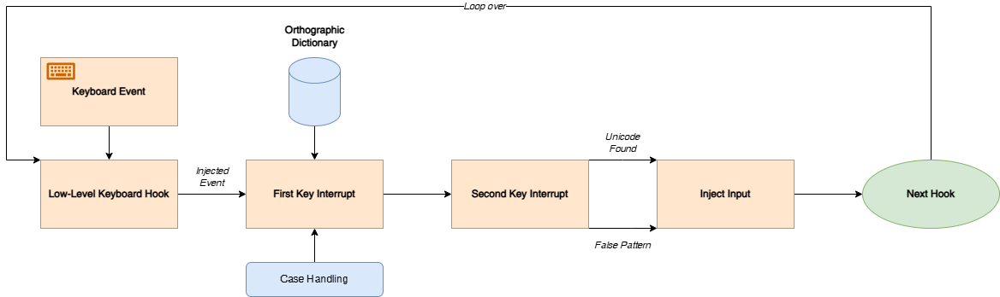

# Mnemonic Keyboard Interceptor

## Description
This program implements a custom low-level keyboard hook which listens (*interrupts*) for keypress events and maps them according to double key sequences. If the right key combinations are inputted, a translated Unicode character output (*diacritic letter*) will be typed instead.

## Overview

## Orthography

In the following table, each letter is represented with its Unicode code points (in UTF-16), suggested keystroke combinations for digital input, and its corresponding International Phonetic Alphabet (IPA) symbol, which clarifies its pronunciation:

| Letter   | Unicode           | Keystrokes            | IPA    |
|:--------:|:-----------------:|:---------------------:|:------:|
| **Aa**   | `0x0041 / 0x0061` | `a`                   | `/a/`  |
| **Āā**   | `0x0100 / 0x0101` | `a` + `a`,  `a` + `h` | `/ɑ/`  |
| **Åå**   | `0x00C5 / 0x00E5` | `o` + `e`             | `/əʊ/` |
| **Əə**   | `0x018F / 0x0259` | `u` + `h`             | `/əː/` |
| **Bb**   | `0x0042 / 0x0062` | `b`                   | `/b/`  |
| **Cc**   | `0x0043 / 0x0063` | `c`                   | `/k/`  |
| **Kk**   | `0x004B / 0x006B` | `k`                   | `/x/`  |
| **Čč**   | `0x010C / 0x010D` | `c` + `h`             | `/tʃ/` |
| **Dd**   | `0x0044 / 0x0064` | `d`                   | `/d/`  |
| **Ee**   | `0x0045 / 0x0065` | `e`                   | `/ɛ/`  |
| **Ēē**   | `0x0112 / 0x0113` | `e` + `e`             | `/e/`  |
| **E̊e̊**   | `0x0065 / 0x030A` | `a` + `y`, `e` + `y`  | `/eɪ/` |
| **Ff**   | `0x0046 / 0x0066` | `f`                   | `/f/`  |
| **Gg**   | `0x0047 / 0x0067` | `g`                   | `/g/`  |
| **Ǧǧ**   | `0x01E6 / 0x01E7` | `g` + `h`             | `/ʁ/`  |
| **Hh**   | `0x0048 / 0x0068` | `h`                   | `/h/`  |
| **Ii**   | `0x0049 / 0x0069` | `i`                   | `/i/`  |
| **Īī**   | `0x012A / 0x012B` | `i` + `i`             | `/ɨ/`  |
| **I̊i̊**   | `0x0069 / 0x030A` | `i` + `y`             | `/ʌɪ/` |
| **Ll**   | `0x004C / 0x006C` | `l`                   | `/l/`  |
| **Mm**   | `0x004D / 0x006D` | `m`                   | `/m/`  |
| **Nn**   | `0x004E / 0x006E` | `n`                   | `/n/`  |
| **Oo**   | `0x004F / 0x006F` | `o`                   | `/o/`  |
| **Ôô**   | `0x00D4 / 0x00F4` | `a` + `w`             | `/ɔ:/` |
| **O̊o̊**   | `0x006F / 0x030A` | `o` + `i` + `o` + `y` | `/ɔɪ/` |
| **Pp**   | `0x0050 / 0x0070` | `p`                   | `/p/`  |
| **Rr**   | `0x0052 / 0x0072` | `r`                   | `/r/`  |
| **Ŕŕ**   | `0x0154 / 0x0155` | `r` + `r`             | `/ɹ/`  |
| **Ss**   | `0x0053 / 0x0073` | `s`                   | `/s/`  |
| **Šš**   | `0x0160 / 0x0161` | `s` + `h`             | `/ʃ/`  |
| **Tt**   | `0x0054 / 0x0074` | `t`                   | `/t/`  |
| **Ţţ**   | `0x0162 / 0x0163` | `t` + `h`             | `/θ/`  |
| **Uu**   | `0x0055 / 0x0075` | `u`                   | `/u/`  |
| **Ūū**   | `0x016A / 0x016B` | `o` + `o`, `u` + `u`  | `/y/`  |
| **Ůů**   | `0x016E / 0x016F` | `u` + `i` + `u` + `y` | `/uɪ/` |
| **Vv**   | `0x0056 / 0x0076` | `v`                   | `/v/`  |
| **Yy**   | `0x0059 / 0x0079` | `y`                   | `/j/`  |
| **Zz**   | `0x005A / 0x007A` | `z`                   | `/z/`  |

## Limitations

- When a first key in the dictionary is ingested, along with another first key as a second key (*it does not exist in the second key dictionary*), it should inject the original first key, clear the buffer, and designate the second key as a new first key.
- When a first key in the dictionary is ingested, along with a space bar as a second key, it should inject the first key only without a space.
- Enable/Disable switch through a designated keypress (likely tilda key).

## Dependencies

This project uses the **ICU (International Components for Unicode) C/C++ library**, specifically the `uchar.h` header (Unicode character properties), from ICU version 77.

ICU is developed and maintained by the Unicode Consortium and IBM.  It is licensed under the Unicode License, which is BSD-like and permissive.

- ICU Project Home: https://icu.unicode.org/
- ICU Source Code: [https://github.com/unicode-org/icu](https://github.com/unicode-org/icu)
    
